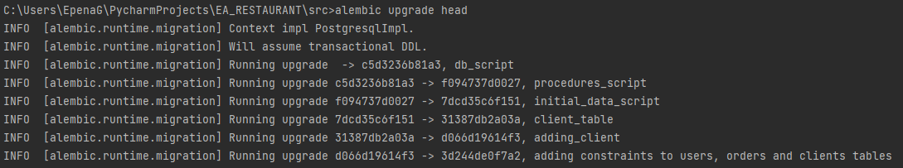

# EA_RESTAURANT

## Italian Restaurant

### This is a project to develop an Italian Restaurant. Menu, products, chefs, orders and inventories will be included.

### ENTITIES:

* Product Entity - This entity will be used to create products like pizza, hamburgers, pasta and beverages.
* Ingredient Entity - This entity will be used to create ingredients to make the products of the restaurant.
* Inventory Ingredient Entity - This entity will be used to store the Ingredients and its quantity
* Inventory Entity - This entity will store all the items and their quantities
* Order details Entity - This entity will store all the details of the order .
* Order entity - This order will be used to process the client order.
* Chef entity - This entity will be used to create the different chefs who will work in the restaurant.

### Repositories:

* Generic Repository - This repository will be used as an interface to expose generic methods that could be used by the
  developer in order to implement generic operation over a given entity.
* Product Repository - This repository will be used to implement operations to manages products entities.
* Item Repository - This repository will be used to implement operations to manages items entities.
* Inventory Ingredient Repository - This repository will be used to implement operations to manages inventory 
  ingredients entities.
* Inventory Repository - This repository will be used to implement operations to manages inventory entities.
* Order Repository - This repository will be used to implement operations to manages orders entities.
* Order Detail Repository - This repository will be used to implement operations to manages orders detail entities.
* Chef Repository - This repository will be used to implement operations to manages chef entities.

### Controllers:

* The controllers work as interface between users and repositories. they will respond to users events and 
  make requests to repositories.

UML Diagram:

## Project Setup

Download and install the following tools:

* [Python 3](https://www.python.org/downloads/)
* [PyCharm](https://www.jetbrains.com/pycharm/)
* [MiniConda](https://docs.conda.io/en/latest/miniconda.html)

### Windows users

* Open `miniconda3`.
* Go to the project path
* Run `conda create --prefix=.venv python=3.10.0`
* In order to activate an environment run the following command: `conda activate .\venv\Scripts\activate.bat`
* In order to update library dependency run the following command : `pip freeze > requirements.txt`
* In order to set Environment variables file :
  * - Use `.env.local.example` file to create the different environment files: local, dev, test. 
  * - choose under which environment you are going to work using command: `SET ENV=local` for local, `SET ENV=test` for
      testing.
  * - Run the script that you want to run under chosen environment.
### Running tests

This project is using [unittest](https://docs.python.org/3/library/unittest.html) for testing. To run tests just
run `python -m unittest discover --pattern=*_test.py`

This project is using [coverage](https://coverage.readthedocs.io/en/latest/index.html) for coverage. To run test
coverage just run the commands:
* coverage run: `coverage run -m unittest discover --pattern=*test.py`
* coverage report: `coverage report --include='src/tests/*'`
* coverage html report: `coverage html --include='src/tests/*'`

### Linter and Formatter

This project is using:

* [black](https://pypi.org/project/black/)
* [isort](https://pypi.org/project/isort/)
* [pylint](https://pypi.org/project/pylint/)

Commands:

* Format: `black .`
* Sort imports: `isort .`
* Lint file: `pylint [path-to-file.py]`

### Migrations

This project is Using [Alembic](https://alembic.sqlalchemy.org/en/latest/) for migrations. To
install alembic in your project just run `pip install alembic`

Commands to use alembic:

* Initialize: `alembic init alembic`
* Migration Script: `alembic revision -m "migration scrip name"` This script contains some header
  information, identifiers for the current version and import a basic alembic directives, and empty
  `upgrade()` and `downgrade()` functions.
* Upgrade: `alembic upgrade <target-revision>`
* Downgrade: `alembic downgrade <target-revision>`
* Upgrade to head: `alembic upgrade head` This command executes all migrations from the current point to the last.

Examples:

Executing `alembic upgrade head` in a clean database will execute all migrations
in the orders that migrations were created. Like example image.
